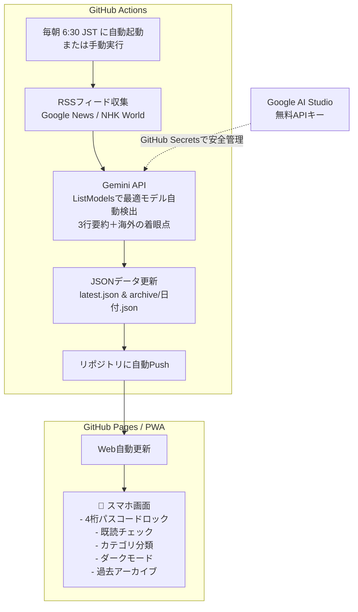

# 📘 J-Global Digest プロジェクト総括＆ナレッジ集

海外ニュースの日本関連記事をGeminiで毎朝要約し、スマホ向けWebアプリ（GitHub Pages）で無料配信する仕組みの全体まとめと、開発中につまずいたポイント・解決策の記録です。今後の他プロジェクトの参考書としてご活用ください。

---

## 1. システム全体像（完全無料アーキテクチャ）

### なぜ完全無料で運用できるのか？
- **サーバー代 0円**: GitHub Actions（月2,000分無料枠）、GitHub Pages（静的ホスティング完全無料）
- **AI利用料 0円**: Google AI Studio（Gemini API 無料枠・1分15回/1日1,500回まで）
- **通信・RSS 0円**: 公開RSSフィードの利用（有料API契約不要）

---

## 2. 構築ステップの流れ

1. **プログラムの用意**:
   - `fetch_and_summarize.py`: RSS取得 ＋ Gemini API要約
   - `docs/`: フロントエンド画面（HTML / CSS / JS / PWAマニフェスト）
   - `.github/workflows/daily_news.yml`: 毎朝の自動実行ワークフロー
2. **GitHubリポジトリ作成 ＆ 初回プッシュ**:
   - ローカルPCのコードをGitHubにアップロード。
3. **APIキーの登録**:
   - Google AI StudioでAPIキーを取得し、GitHubの「Repository secrets」に登録。
4. **GitHub Pagesの有効化**:
   - リポジトリの Settings > Pages で `main` ブランチの `/docs` を公開先に指定。

---

## 3. つまずいたポイント＆トラブルシューティングの全記録

今回発生したエラーやつまずきポイントは、**エンジニアや初学者が非常によく直面する「重要パターン」**ばかりでした。次回以降のプロジェクトで同じ状況になったときに、すぐ解決できるように整理しました。

| # | 現象・エラー | 原因 | 解決策（学び） |
| :--- | :--- | :--- | :--- |
| **1** | **Settings > Pages で `main` ブランチが表示されない（Noneしかない）** | PCからGitHubへまだ初回プッシュ（`git push`）しておらず、GitHub側が「空っぽ（ブランチゼロ）」だったため。 | まずPCから `git push` を行ってGitHub上にファイルを送信してから、Pages設定画面を再読み込みする。 |
| **2** | **ターミナルで `fatal: not a git repository` と表示される** | ターミナルの現在地（作業フォルダ）がプロジェクトフォルダではなく、ホームフォルダなど別の場所になっていたため。 | `cd /Users/sin5/Documents/Antigravity-Japan-news` でプロジェクトフォルダへ移動してからコマンドを実行する。 |
| **3** | **プッシュ時に `! [remote rejected] without workflow scope` で拒否される** | GitHubトークン（Personal Access Token）の権限に、ワークフロー変更用の `workflow` 権限が入っていなかったため（GitHubの安全仕様）。 | トークンの編集画面で `workflow`（Update GitHub Action workflows）のチェックボックスをオンにして更新する。 |
| **4** | **Webページの日付だけ変わり、内容がサンプルのまま更新されない** | ① `GEMINI_API_KEY` がActionsに正しく渡っていなかった。 ② APIキー登録後、次回の朝6:30まで自動実行が走らないため。 | ① 「Environment」ではなく「Repository secrets」に登録する。 ② 今すぐ確認したい時は、Actionsタブの「Run workflow」を手動実行する。 |
| **5** | **`HTTP 404: models/gemini-1.5-pro is not found` とエラーが出る** | 指定したGeminiモデル名がAPIエンドポイント側で変更・廃止されていたため。 | 固定のモデル名ではなく、Googleの `ListModels` API を使って**「現在利用可能なモデルを動的に自動検出・選択する仕組み」**に改修して根本解決。 |
| **6** | **GitHubトークンの有効期限（11月1日）が切れたら自動更新は止まる？** | 毎朝の自動更新はGitHub内部キー（`GITHUB_TOKEN`）で動くため、ユーザーのトークン期限が切れても更新は止まらない。 | ユーザーが発行したトークンは「MacからGitHubへ手動プッシュするとき専用」。期限が切れても日々の自動更新には影響なし。 |

---

## 4. 他のプロジェクトを始めるときの「鉄則チェックリスト」

次回、同様の自動化ツールやWebアプリを作る際は、以下の手順通りに進めるとスムーズです：

- [ ] **1. カレントディレクトリの確認**
  - ターミナルを開いたら、必ず `pwd` で今いるフォルダを確認し、プロジェクトフォルダに `cd` しておく。
- [ ] **2. GitHubトークン（PAT）の発行時の権限**
  - GitHub Actionsのファイル（`.github/`）を含む場合は、最初から **`repo`** と **`workflow`** の両方にチェックを入れて発行する。
- [ ] **3. Secretsの登録場所**
  - Settings > Secrets and variables > Actions の画面では、必ず下の **「Repository secrets」** の「New repository secret」を使う。
- [ ] **4. APIキー登録後のテスト**
  - 定期実行（cron）を待たずに、Actionsタブの **「Run workflow」** で即時手動テストしてログを確認する。
- [ ] **5. AIモデルの指定方法**
  - AIモデルは仕様変更が早いため、固定の文字列だけでなく、利用可能なモデル一覧（ListModels）を取得するか、複数モデルにフォールバックできるようにしておく。

---

## 5. まとめ

お困りだったポイントを一つずつ確実にクリアしたことで、
- **安全なパスコード認証付きWebアプリ**
- **自律的・継続的に動くクラウド自動化環境**
- **モデル仕様変更にも強い柔軟なスクリプト**

という非常に完成度の高いシステムに仕上がりました。
別のアイデア（株価要約、海外テックトレンド収集、趣味のニュースまとめ等）を始める際も、全く同じテンプレートで流用できます！
